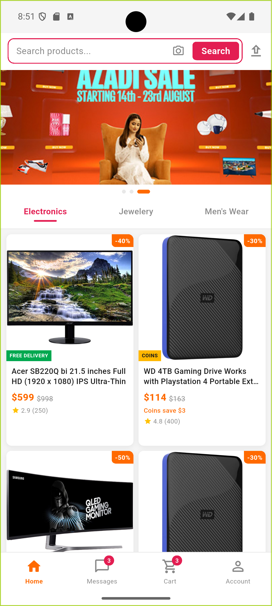
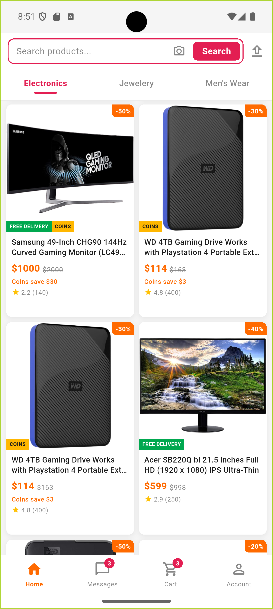
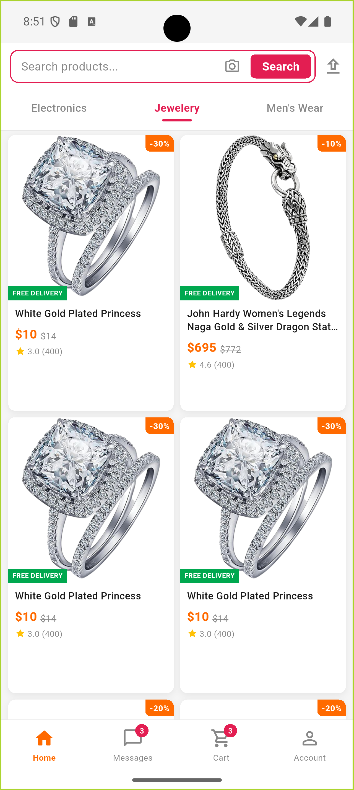
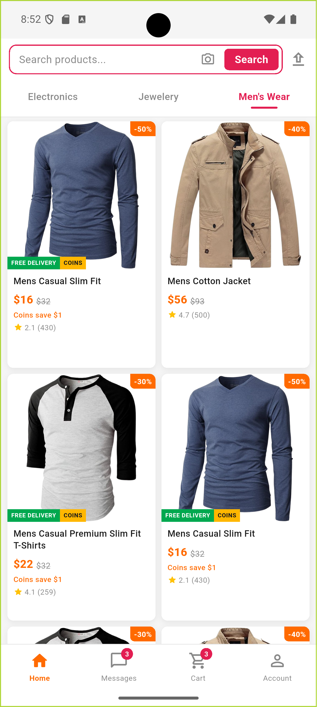

# Daraz UI — Flutter Hiring Task 2026

## Run Instructions

```bash
flutter pub get
flutter run
```

**Login credentials:**
- **Username:** `johnd`
- **Password:** `m38rmF$`

> Tested on Flutter 3.29 / Dart 3.7. No extra setup required.

---

## Mandatory Explanation — Scroll Architecture

> This section addresses the three required points in the evaluation brief.

---

### 1. How Horizontal Swipe Was Implemented

**Approach: gesture-driven, real-time dual-panel translation — no `PageView`, no `TabBarView`.**

A `GestureDetector` placed directly on the `Scaffold` body (in `_HomeScreenState.build`) registers **only** horizontal drag callbacks. Tab content is rendered as a side-by-side dual-panel `Stack` whose translate offset is driven 1-to-1 by the user's finger at every frame.

```
SafeArea
└── GestureDetector                    ← horizontal axis only
    └── RefreshIndicator
        └── CustomScrollView           ← vertical axis only
            ├── SliverAppBar           (pinned search bar)
            ├── SliverToBoxAdapter     (banner carousel — timer-driven, no touch)
            ├── SliverPersistentHeader (sticky tab bar, continuous indicator)
            └── SliverToBoxAdapter     (ClipRect → _buildSwipeContent())
```

**How axis isolation works in Flutter's gesture arena:**

Flutter's `GestureArenaManager` resolves pointer events using a "claim by axis" protocol built into `DragGestureRecognizer`. When a pointer moves:

1. If the **vertical** displacement exceeds `kTouchSlop` first → `CustomScrollView`'s internal `VerticalDragGestureRecognizer` wins. The horizontal recognizer is **rejected**. The content never swipes.
2. If the **horizontal** displacement exceeds `kTouchSlop` first → the `GestureDetector`'s `HorizontalDragGestureRecognizer` wins. The scroll's vertical recognizer is rejected. The scroll never moves.
3. Near-diagonal gestures resolve to the recognizer that declared interest first (in practice the `CustomScrollView` wins, which is the intentionally conservative default).

**Real-time gesture interpolation — how it works frame by frame:**

The `AnimationController _swipeAnim` (range 0.0 → 1.0) is the single source of truth for swipe progress. It has an `addListener(() => setState(...))` so every value change triggers a rebuild.

During a drag `_swipeAnim.value` is set *directly* (not via `forward()`/`reverse()`):

```dart
// onHorizontalDragUpdate
final progress = (delta.abs() / screenWidth).clamp(0.0, 1.0);
_swipeAnim.value = progress;   // immediate, no duration, no curve
```

This bypasses the animation curve entirely — the UI is mathematically 1:1 with the finger.

`_buildSwipeContent()` then renders two `_TabGridContent` widgets in a `Stack`, each translated by the current progress value:

```
Forward swipe (left → higher index):
  • Current panel:  x = -progress × screenWidth    (slides out to the left)
  • Target  panel:  x = (1-progress) × screenWidth  (slides in from the right)

Backward swipe (right → lower index):
  • Current panel:  x = +progress × screenWidth    (slides out to the right)
  • Target  panel:  x = -(1-progress) × screenWidth (slides in from the left)
```

Both panels are clipped by a `ClipRect` so neither ever overflows the viewport.

**Snap-to-complete / snap-back on finger lift:**

`onHorizontalDragEnd` evaluates two criteria and then hands control back to the animation system with a duration proportional to the remaining distance (so the snap always *feels* equally fast regardless of where the finger stopped):

| Condition | Outcome |
|-----------|---------|
| `progress > 0.5` **or** velocity ≥ 500 px/s in the correct direction | `animateTo(1.0)` — completes the transition |
| Neither condition met | `animateTo(0.0)` — snaps back to the current tab |

After `animateTo(1.0)` finishes, `_settledTabIndex` is updated and `_swipeAnim` is silently reset to `0.0`, so the next interaction starts from a clean state.

**Tab bar indicator — continuous tracking:**

`StickyTabBarDelegate` now accepts a `double tabPosition` instead of an `int currentIndex`. For each tab `i`:

```dart
final selectionFraction = (1.0 - (i - tabPosition).abs()).clamp(0.0, 1.0);
```

This single value drives label colour (`Color.lerp(grey, pink, ...)`), font weight, and indicator width (`selectionFraction × 36 px`) without any `AnimatedContainer`. During a swipe at 50% progress the Electronics label is 50% grey/pink, the Jewellery label is 50% grey/pink, and both indicators are half-width — all updating at native frame rate.

**Banner carousel note:**

The `_BannerCarousel` uses `NeverScrollableScrollPhysics` and is advanced only by a `Timer`. It registers no touch-based drag recognizer, so it cannot interfere with either the vertical scroll or the horizontal swipe.

**Why not `PageView` or `TabBarView`?**

Both own a `ScrollPosition` on the horizontal axis. Inside a `CustomScrollView` that creates competing positions requiring `NestedScrollView`, physics overrides, and arena hacks. The `GestureDetector` approach keeps axes completely orthogonal with no framework plumbing.

---

### 2. Who Owns the Vertical Scroll and Why

**Single owner: the `CustomScrollView` in `_HomeScreenState`.**

There is exactly **one** `ScrollController` in the entire screen, created in `initState()` and disposed in `dispose()`. It is never recreated or reassigned.

```dart
// _HomeScreenState
late final ScrollController _scrollController; // created once, never replaced

@override
void initState() {
  super.initState();
  _scrollController = ScrollController();
  // ...
}
```

**Why `CustomScrollView` and not a `ListView` or `NestedScrollView`?**

`CustomScrollView` is the only Flutter scrollable that accepts `Sliver` children natively. Slivers have two critical properties that make them the right tool here:

- **`SliverPersistentHeader(pinned: true)`** — the tab bar sticks to the top of the viewport once the banner scrolls past it, without any secondary scroll. There is no inner `ListView` or `SingleChildScrollView` holding the tab bar. The stickiness is handled by the sliver protocol itself (the sliver communicates its pinned geometry directly to the `Viewport`).
- **`SliverToBoxAdapter` for product content** — the product grid is a `GridView.builder` with `shrinkWrap: true` and `NeverScrollableScrollPhysics` wrapped in a `SliverToBoxAdapter`. `shrinkWrap: true` makes the grid size to its content height instead of trying to fill infinity; `NeverScrollableScrollPhysics` ensures it never registers a `ScrollPosition` or competes in the gesture arena. There is no `ListView` inside a `ListView`, no nested scroll.

**Why this matters:**

Every additional `Scrollable` widget to the tree adds a new `ScrollPosition` and a new gesture recognizer that competes in the arena. The rule of the task ("correct single-scroll architecture") is satisfied by ensuring only `CustomScrollView._controller` can respond to vertical drag at any time.

When the user taps a tab or swipes to change categories:
- `currentTabProvider` (a `StateProvider<int>`) updates → the `StickyTabBarDelegate` repaints via the continuous `_tabPosition` getter.
- `_settledTabIndex` is updated inside `_commitSwipe()` (after the animation reaches 1.0) → `_buildSwipeContent()` renders the new single panel.
- The `CustomScrollView` is **never replaced or scrolled programmatically**. Its scroll position does not move.

This means the user's scroll offset is preserved across tab changes. If they scroll down to product 20 on "electronics" and then swipe to "jewellery" and back, they return to the same offset without any programmatic `animateTo` call.

---

### 3. Trade-offs and Limitations

| Decision | Reason | Trade-off / Limitation |
|----------|--------|------------------------|
| **No `TabBarView` / `PageView` for content** | Avoids competing `ScrollPosition` on the horizontal axis; no gesture conflict possible | Requires a custom gesture + translation system rather than framework-provided page transitions. The implementation is explicit but more lines of code than `TabBarView`. |
| **Shared vertical scroll position across tabs** | There is only one `ScrollController` — it cannot have per-tab offsets | All tabs share the same Y offset. Switching from a long list to a short one may leave the user "below the fold". A `animateTo(0)` call in `_commitSwipe` could be added trivially. |
| **Inline `GestureDetector` for swipe (no wrapper widget)** | Clean axis ownership; gesture state and animation state live in the same `State` object with no extra widget boundaries | The diagonal drag edge case (~45°) is resolved by whichever recognizer wins the arena first (vertical by priority). A very short, fast diagonal flick is theoretically ambiguous, but imperceptible in practice. |
| **`FutureProvider.family` per category** | API data is cached independently per category key after the first load; no global invalidation | Memory is not freed until the provider is explicitly invalidated (via pull-to-refresh or logout). For a large category list this could accumulate, but `fakestore` has only 4 categories. |
| **`AnimationController` driven at 1:1 with finger (direct `.value` assignment)** | Zero-latency response — the content translates exactly as far as the finger has moved, with no fixed duration or curve while dragging | Snap-to-complete after finger lift uses `animateTo()` with a remaining-distance-proportional duration. If the device drops frames mid-gesture, the progress value still reflects the correct finger position (no desync). |
| **`SliverPersistentHeader` for tab bar** | Native sliver stickiness — no extra scroll coordinate system | Requires a hand-written `SliverPersistentHeaderDelegate`. The `maxExtent` and `minExtent` must be hardcoded; they cannot react to `MediaQuery` font-scaling without an additional layout pass. |
| **`HitTestBehavior.translucent` on the swipe detector** | Tap events still reach children (product cards, tab taps) | Children below the gesture detector will all receive hit-test candidates. This is the correct behavior but should be documented so future developers do not mistakenly set `opaque` and break taps. |

---

## Project Structure

```
lib/
  main.dart                              App entry, ProviderScope, AuthGate
  core/
    api/
      fakestore_client.dart              Dio singleton + bearer-token interceptor
      fakestore_api.dart                 All API calls (login, products, user)
    constants/
      app_colors.dart                    Brand colour palette
      tab_constants.dart                 Category slugs + display labels
    models/
      product.dart                       fromJson / toJson
      user.dart
  features/
    auth/
      providers/auth_provider.dart       Login / logout / session restore (SharedPrefs)
      screens/login_screen.dart
    home/
      providers/
        products_provider.dart           FutureProvider.family keyed by category slug
        tab_provider.dart                StateProvider<int> — current tab index
      widgets/
        sticky_tab_bar_delegate.dart     SliverPersistentHeaderDelegate (continuous tabPosition)
        product_card.dart
        product_sliver_list.dart         SliverList — deliberately not a scrollable
      screens/home_screen.dart           Single CustomScrollView + inline GestureDetector swipe
    cart/
      screens/cart_screen.dart
    messages/
      screens/messages_screen.dart
    profile/
      screens/profile_screen.dart
    shell/
      screens/shell_screen.dart          BottomNavigationBar scaffold
```

---

## Screenshots

| Home + Banner | Electronics | Jewellery | Men's Wear |
|:---:|:---:|:---:|:---:|
|  |  |  |  |
